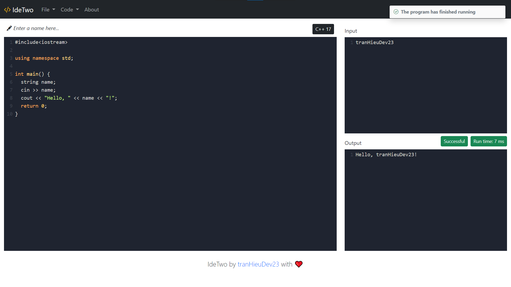

# IdeTwo



A (very bare-bones) clone of [Ideone](https://ideone.com/) - the online IDE, compiler and debugging tool. It supports C, C++, Java and Python 3 out of the box, but can be extended to be used with any language.

## Architecture

The program consists of an [Angular](https://angular.io/) front-end and a [Gin](https://gin-gonic.com/) backend. The backend uses [MongoDB](https://www.mongodb.com/) for data storage, [Faktory](https://contribsys.com/faktory/) to queue up execution requests and [Docker](https://docker.com/) to containerize source code compilation and execution.

Whenever the user makes an execution request, the request will be placed in the `default` queue of Faktory to be handled sequentially by the [`FaktoryWorker`](controllers/workers/execute_worker/execute_worker.go). The worker compiles (for C/C++/Java sources) and executes each request in Docker containers with the following specification:

-   1 CPU core
-   1 GB of RAM
-   30 second of run time

If the source code fails to compile, takes too long to compile or execute, or exits with a non-zero code, the job is canceled and the error log and exit code are stored in the database.

## Installation

MongoDB, Faktory and Docker Engine are required to run this program. This can be easily achieved by installing Docker alone, then run a [MongoDB](https://hub.docker.com/_/mongo) and a [Faktory container](https://hub.docker.com/r/contribsys/faktory). Configuration to connect to these two services can be found in [.env](.env).

Since the front end is a separate project inside the `views` folder, you will need to compile the front end first before compiling and running the back end.

```bash
# Compile the front end.
cd views
npm install
ng build -c production
cd ..

# Compile the back end.
go build main.go

# The program uses Docket Engine's Golang SDK underneath, so we need to config
# environment variables as described in
# https://pkg.go.dev/github.com/docker/docker/client#FromEnv.
export DOCKER_HOST=tcp://localhost:2375

# Run in release mode. Skip this line if running in debug mode.
export GIN_MODE=release

# Start the server to listen to port 8080.
./main
```

## Configuration

These field can be edited inside the file [.env](.env):

| Field                        | Description                                                                                |
| ---------------------------- | ------------------------------------------------------------------------------------------ |
| `IDETWO_EXECUTIONS_DIR`      | The root temporary directory for executions. Usually there is no reason to configure this. |
| `MONGODB_URI`                | The URI to connect to the MongoDB instance.                                                |
| `MONGODB_DB`                 | The database name of the program.                                                          |
| `FAKTORY_URL`                | The address of the Faktory server.                                                         |
| `FAKTORY_POOL_CAPACITY`      | The number of Faktory connections to maintain.                                             |
| `FAKTORY_WORKER_CONCURRENCY` | The number of goroutine used to handle worker requests.                                    |

## Support for other programming languages

`FaktoryWorker` uses the [`JobExecutor`](controllers/workers/execute_worker/job_executor/job_executor.go) interface as an abstraction of the underlying compilation + execution logic for each programming language. By extending this interface, you can add support for any programming languages.

Detailed steps to add support for a new programming languages:

1. Add the programming language to the `ProgrammingLanguage` enum inside [source_code.go](models/source_code/source_code.go).
2. Implement a new `struct` that implements the `JobExecutor` interface.
3. Add the `struct` as a case inside the `executeJob()` function in `FaktoryWorker`.
4. Add the programming language to the `ProgrammingLanguage` enum inside [source_code.ts](views/src/models/source_code.ts), plus editing related functions in the file.
5. Profit 💰

## Licence

MIT
